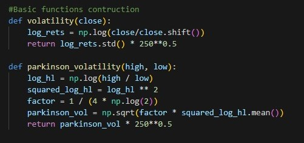
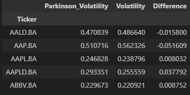
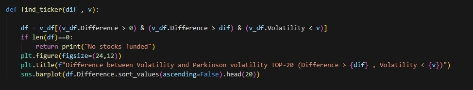
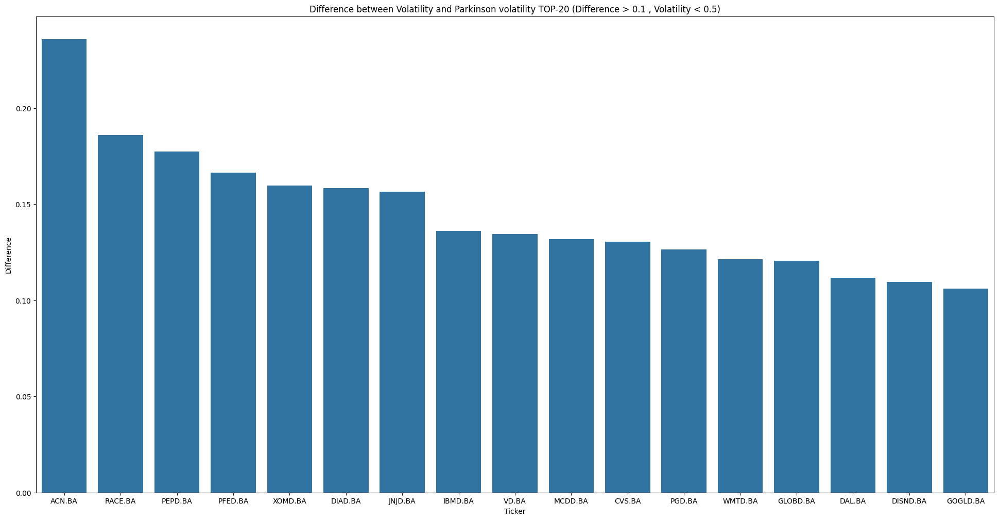

## Motivation

Calculating the difference between Parkinson's volatility and normal volatility is useful for trading low-liquidity financial assets.

**A high Parkinson's volatility with a low normal volatility tells us about a profitable trading opportunity with low risk.**

In this case, we create a function that returns a bar chart with the top-20 spreads given 2 limits: an upper limit for the volatility and a lower limit for the difference value.

Market data is from the last 3 months provided by **yfinance**

## Basic Functions 

Formulas for each type of volatility.

Normal volatility has as input the **Close** price serie.

Parkinson´s volatility has as input **Low** and **High** price series.

We then define our **v_df** dataset that we will work with, which contains both volatilities with their difference for each Ticker. 

## Final function

 The last function **find_ticker** with inputs: 
 
♦ **dif** which is the minimum difference between both volatilities that we want  

 
 ♦ **v** which is the maximum normal volatility (**Risk**) that we want to assume 

 

Search in **v_df** for all the stocks that meet those requirements and return a bar chart with the first 20 ordered by the difference between volatilities

